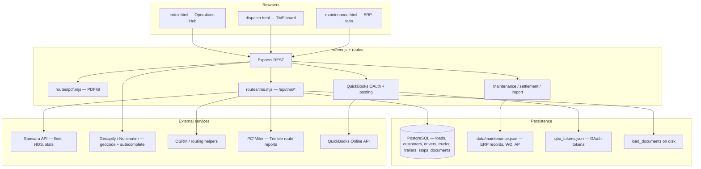

# Dispatch & TMS — software architecture

This repository is a **single Node.js (ESM) Express app** that serves static HTML/CSS/JS from `public/` and exposes JSON APIs. Operational data splits across **PostgreSQL** (loads, stops, fleet master) and **JSON files on disk** (maintenance ERP, QBO token cache).

## High-level diagram

## Layers

| Layer | Role |
|--------|------|
| **UI** | Vanilla JS pages (`dispatch.html`, `maintenance.html`, `fuel.html`, …). Shared top nav: `public/js/board-nav.js` + `public/css/board-nav.css`. |
| **API** | `server.js` mounts `tmsRouter` at `/api/tms` and `pdfRouter` at root (PDF routes are `/api/pdf/...`). Maintenance, QBO, settlement, geocode, and imports remain on `server.js`. |
| **TMS domain** | `routes/tms.mjs` — CRUD for loads/stops, lookups, leg-mile computation (PC*Miler → OSRM → haversine), Samsara fleet list, load document uploads. |
| **Schema** | `database/migrations/*.sql` defines core tables; `lib/tms-schema.mjs` runs idempotent `ALTER` / `CREATE IF NOT EXISTS` at startup when `DATABASE_URL` is set. |
| **ERP** | `data/maintenance.json` (or `/var/data` on Render) — maintenance records, work orders, AP rows; QBO catalog cache embedded in same file. |
| **Integrations** | `lib/samsara-client.mjs`, `lib/pcmiler.mjs`, QBO helpers inside `server.js`. |

## Data ownership

- **Postgres**: authoritative for **loads**, **load_stops**, **customers**, **drivers**, **trucks**, **trailers**, **load_documents** metadata, revenue/QBO refs on loads as migrated.
- **JSON ERP**: authoritative for **maintenance/service history**, **work orders**, **AP transactions** not yet fully mirrored in PG; QBO posting updates rows with `qboEntityId` / errors.
- **Fleet identity for dispatch UI**: **Samsara** vehicles (`GET /api/tms/fleet/samsara-vehicles`) drive the Fleet tab and truck datalist priority; local `trucks` table + QBO classes remain for accounting/class mapping.

## Key HTTP surfaces

### TMS (`/api/tms`)

- `GET /meta`, `GET /meta/next-load-number`
- `GET|POST /customers`, `GET|POST /drivers`, `GET|POST /trucks`, `GET|POST /trailers`
- `GET /loads?tab=...`, `GET /loads/:id`, `POST /loads`, `PATCH /loads/:id`, `DELETE /loads/:id`
- `GET|POST /loads/:id/documents`, `GET .../documents/:docId/download`
- `GET /loads/by-number/:loadNumber`
- `GET /fleet/samsara-vehicles`
- `POST /compute-leg-miles`

### PDFs (`/api/pdf`)

- `GET /api/pdf/tms-load/:id`
- `GET /api/pdf/maintenance-record/:id`
- `GET /api/pdf/ap-transaction/:id`
- `GET /api/pdf/work-order/:id`

### Health

- `GET /api/health` — process + Samsara probe + integration flags (see response JSON).
- `GET /api/health/db` — Postgres connectivity.

### QuickBooks (selected)

- `GET /api/qbo/status`, `GET /api/qbo/connect`, `GET /api/qbo/callback`
- `GET /api/qbo/catalog`, `POST /api/qbo/catalog/refresh`, `GET /api/qbo/master`
- Posting: `POST /api/qbo/post-record/:id`, `post-work-order`, `post-ap`, `invoice-from-load`

Background **master-data sync** runs on an interval when QBO tokens exist (`QBO_AUTO_SYNC_MINUTES`, default 360). Each sync also pulls **employees** and (unless `QBO_SYNC_TRANSACTION_DAYS=0`) recent **Bills, Purchases, VendorCredits, Invoices** for reporting.

### Reports

- `GET /api/reports/summary` — TMS counts, ERP maintenance aggregates, QBO cache stats, posting health, transaction window totals.
- `GET /api/reports/export/maintenance-by-unit.csv` — CSV export of maintenance cost by unit.

The ERP **Reports Board** (`maintenance.html`, section `reports`) renders these endpoints.

### PDF autofill & external TMS

- `POST /api/documents/parse-rate-confirmation` — multipart field `pdf`; returns heuristics for load #, revenue, miles, addresses, dates (text-based PDFs).
- `POST /api/documents/parse-expense-invoice` — multipart field `pdf`; returns invoice #, date, amount, unit guess for maintenance/AP lines.
- `GET /api/integrations/status` — Alvys / Always Track configuration flags (no secrets).
- `GET /api/integrations/alvys/drivers` — proxies to Alvys `drivers/search` when `ALVYS_API_TOKEN` is set.
- `GET /api/integrations/always-track/health` — optional ping when `ALWAYS_TRACK_*` is configured.

**Always Track:** there is no documented public API in-repo; the env vars support a **custom REST URL** if your account provides one. **Alvys** uses the official integrations host and Bearer token from their docs.

## Environment variables (conceptual groups)

- **Core**: `PORT`, `HOST`, `DATABASE_URL`, `DATABASE_SSL`
- **Maps / miles**: `GEOAPIFY_API_KEY`, `PCMILER_API_KEY`, `PCMILER_DATA_VERSION`, `PCMILER_ROUTING_TYPE`
- **Fleet**: `SAMSARA_API_TOKEN`
- **QBO**: `QBO_CLIENT_ID`, `QBO_CLIENT_SECRET`, `QBO_REDIRECT_URI`, `DEFAULT_QBO_*`, `QBO_AUTO_SYNC_MINUTES`
- **Business defaults**: `DEFAULT_NEXT_LOAD_NUMBER`, `DRIVER_SETTLEMENT_PAY_PCT`, fuel/detour envs as in `.env.example`

## Development commands

- `npm run dev` — `node --watch server.js`
- `npm run db:migrate` — apply SQL migrations
- `npm run db:test` — verify DB connection

## Suggested evolution (architecture)

1. **Thin the monolith**: move QBO routes into `routes/qbo.mjs` and ERP routes into `routes/erp.mjs` without changing URLs.
2. **Promote ERP entities to Postgres** when you need reporting/audit across maintenance and loads in one SQL store.
3. **Auth**: add session/JWT or SSO before exposing beyond trusted networks; tighten CORS from `*`.
4. **Jobs**: move QBO sync and heavy imports to a worker or queue if intervals/imports grow.

This document reflects the codebase layout as of the current branch; adjust as modules are extracted.
