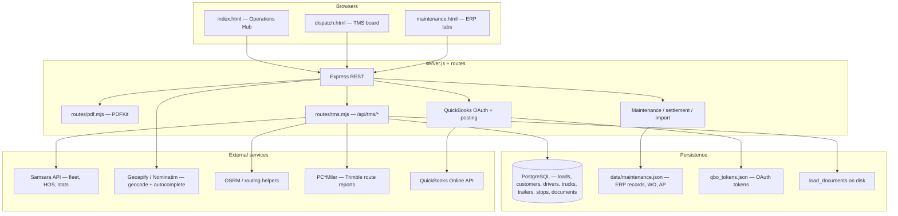

# Dispatch & TMS — software architecture

This repository is a **single Node.js (ESM) Express app** that serves static HTML/CSS/JS from `public/` and exposes JSON APIs. Operational data splits across **PostgreSQL** (loads, stops, fleet master) and **JSON files on disk** (maintenance ERP, QBO token cache).

## High-level diagram

## Layers

| Layer | Role |
|--------|------|
| **UI** | Vanilla JS pages (`dispatch.html`, `maintenance.html`, `fuel.html`, …). Shared top nav: `public/js/board-nav.js` + `public/css/board-nav.css`. |
| **API** | `server.js` mounts `tmsRouter` at `/api/tms` and `pdfRouter` at root (PDF routes are `/api/pdf/...`). Maintenance, QBO, settlement, geocode, and imports remain on `server.js`. |
| **TMS domain** | `routes/tms.mjs` — CRUD for loads/stops, lookups, leg-mile computation (PC*Miler → OSRM → haversine), Samsara fleet list, load document uploads. |
| **Schema** | `database/migrations/*.sql` defines core tables; `lib/tms-schema.mjs` runs idempotent `ALTER` / `CREATE IF NOT EXISTS` at startup when `DATABASE_URL` is set. |
| **ERP** | `data/maintenance.json` (or `/var/data` on Render) — maintenance records, work orders, AP rows; QBO catalog cache embedded in same file. |
| **Integrations** | `lib/samsara-client.mjs`, `lib/pcmiler.mjs`, QBO helpers inside `server.js`. |

## Data ownership

- **Postgres**: authoritative for **loads**, **load_stops**, **customers**, **drivers**, **trucks**, **trailers**, **load_documents** metadata, revenue/QBO refs on loads as migrated.
- **JSON ERP**: authoritative for **maintenance/service history**, **work orders**, **AP transactions** not yet fully mirrored in PG; QBO posting updates rows with `qboEntityId` / errors. Maintenance records may include **`costLines`** `{ description, amount, quantity?, unitPrice? }[]` for one-invoice splits; when `quantity` and `unitPrice` are set, **`amount`** is qty × unit while **`cost`** remains the invoice total (sum of lines).
- **Fleet identity for dispatch UI**: **Samsara** vehicles (`GET /api/tms/fleet/samsara-vehicles`) drive the Fleet tab and truck datalist priority; local `trucks` table + QBO classes remain for accounting/class mapping.

## Single source of truth (practical model)

QuickBooks Online is the **system of record for accounting master data and posted money** (customers, vendors, items, expense/income accounts, bank/CC accounts, classes, bills/purchases in the sync window). It is **not** a fleet telematics registry: truck identity, odometer, fuel, GPS, and driver assignments come from **Samsara** (and optionally merge with **Postgres** `trucks` / `trailers` for TMS-specific fields).

| Concern | Canonical source | Sync / join |
|--------|-------------------|-------------|
| Physical units, live odometer/fuel, HOS, assignments | **Samsara** | `fetchTrackedFleetSnapshot()` in `server.js` — same merge for `/api/board`, `/api/maintenance/dashboard`, `/api/maintenance/dispatch-alerts` so dashboards and tabs agree on **which units exist** and **current mileage** for ERP rules. |
| TMS load, revenue, invoice link | **Postgres** | Dispatch board + PDFs; QBO invoice id stored on load after create. |
| Maintenance history, WO, manual mileage override, AP drafts in ERP file | **`data/maintenance.json`** | Written on save/import; QBO ids back-filled when posted. |
| Vendor/item/account/class lists for pickers | **`erp.qboCache`** (from QBO) | `POST /api/qbo/catalog/refresh` + periodic auto-sync; all pages that show QBO pickers should refresh after connecting QBO. |
| Posted maintenance/AP lines in QBO | **QuickBooks** | Source of truth after post; local row keeps `qboPurchaseId` / errors for reconciliation. |

**Join key across systems:** use a stable **unit code** (e.g. Samsara `vehicle.name` such as `T145`) aligned with TMS **`trucks.unit_code`** / dispatch **truck assignment** and ERP keys in `currentMileage` / records. QBO **Class** names often mirror that code for invoice line classification — keep naming consistent in QBO and TMS.

**Keeping UIs in sync (without one giant database yet):**

1. After any mutation (save load, save maintenance record, post to QBO), **reload** the relevant API bundle the page already uses (`loadAll()` on maintenance, `loadTab()` on dispatch, etc.).
2. Treat **`refreshedAt`** on `/api/board` and `/api/maintenance/dashboard` as the snapshot time for Samsara-backed fields; QBO catalog has its own timestamp in master sync responses.
3. Prefer **one ERP read** per screen load where possible (`/api/maintenance/dashboard` already bundles vehicles + dashboard + records); avoid maintaining a second shadow copy of fleet data in `localStorage`.
4. **Future consolidation:** move maintenance records + AP into Postgres with foreign keys to `trucks.id` and QBO ids as columns; keep QBO sync jobs writing through a single service layer. Until then, the split in the diagram above is intentional and workable if join keys stay strict.

## Key HTTP surfaces

### TMS (`/api/tms`)

- `GET /meta`, `GET /meta/next-load-number`
- `GET|POST /customers`, `GET|POST /drivers`, `GET|POST /trucks`, `GET|POST /trailers`
- `GET /loads?tab=...`, `GET /loads/:id`, `POST /loads`, `PATCH /loads/:id`, `DELETE /loads/:id`
- `GET|POST /loads/:id/documents`, `GET .../documents/:docId/download`
- `GET /loads/by-number/:loadNumber`
- `GET /fleet/samsara-vehicles`
- `POST /compute-leg-miles`

### Maintenance catalog (Postgres)

- `GET /api/maintenance/service-types` — `names[]` from table `maintenance_service_catalog` when `DATABASE_URL` is set (seeded on startup); otherwise built-in defaults.
- `POST /api/maintenance/service-types` — JSON `{ "name": "…" }` appends or reactivates a row (requires database).

### PDFs (`/api/pdf`)

- `GET /api/pdf/tms-load/:id`
- `GET /api/pdf/maintenance-record/:id`
- `GET /api/pdf/ap-transaction/:id`
- `GET /api/pdf/work-order/:id`

### Health

- `GET /api/health` — process + Samsara probe + integration flags (see response JSON).
- `GET /api/health/db` — Postgres connectivity.

### QuickBooks (selected)

- `GET /api/qbo/status`, `GET /api/qbo/connect`, `GET /api/qbo/callback`
- `GET /api/qbo/catalog`, `POST /api/qbo/catalog/refresh`, `GET /api/qbo/master`
- Posting: `POST /api/qbo/post-record/:id`, `post-work-order`, `post-ap`, `invoice-from-load`

Background **master-data sync** runs on an interval when QBO tokens exist (`QBO_AUTO_SYNC_MINUTES`, default 360). Each sync also pulls **employees** and (unless `QBO_SYNC_TRANSACTION_DAYS=0`) recent **Bills, Purchases, VendorCredits, Invoices** for reporting.

### Reports

- `GET /api/reports/summary` — TMS counts, ERP maintenance aggregates, QBO cache stats, posting health, transaction window totals.
- `GET /api/reports/export/maintenance-by-unit.csv` — CSV export of maintenance cost by unit.

The ERP **Reports Board** (`maintenance.html`, section `reports`) renders these endpoints.

### PDF autofill & external TMS

- `POST /api/documents/parse-rate-confirmation` — multipart field `pdf`; returns heuristics for load #, revenue, miles, addresses, dates (text-based PDFs).
- `POST /api/documents/parse-expense-invoice` — multipart field `pdf`; returns invoice #, date, amount, unit guess for maintenance/AP lines.
- `GET /api/integrations/status` — Alvys / Always Track configuration flags (no secrets).
- `GET /api/integrations/alvys/drivers` — proxies to Alvys `drivers/search` when `ALVYS_API_TOKEN` is set.
- `GET /api/integrations/always-track/health` — optional ping when `ALWAYS_TRACK_*` is configured.

**Always Track:** there is no documented public API in-repo; the env vars support a **custom REST URL** if your account provides one. **Alvys** uses the official integrations host and Bearer token from their docs.

## Environment variables (conceptual groups)

- **Core**: `PORT`, `HOST`, `DATABASE_URL`, `DATABASE_SSL`
- **Maps / miles**: `GEOAPIFY_API_KEY`, `PCMILER_API_KEY`, `PCMILER_DATA_VERSION`, `PCMILER_ROUTING_TYPE`
- **Fleet**: `SAMSARA_API_TOKEN`
- **QBO**: `QBO_CLIENT_ID`, `QBO_CLIENT_SECRET`, `QBO_REDIRECT_URI`, `DEFAULT_QBO_*`, `QBO_AUTO_SYNC_MINUTES`
- **Business defaults**: `DEFAULT_NEXT_LOAD_NUMBER`, `DRIVER_SETTLEMENT_PAY_PCT`, fuel/detour envs as in `.env.example`

## Development commands

- `npm run dev` — `node --watch server.js`
- `npm run db:migrate` — apply SQL migrations
- `npm run db:test` — verify DB connection

## ERP shell verification (master redesign)

Automated guards and pre-release QA for **`maintenance.html`**, shared CSS, and satellite pages are documented here:

- **Local automated gate:** root [`README.md`](../README.md) — *Verification (automated)* — `npm run rule0:check`, `npm run smoke`, `npm run qa:automated` (server must be up), or `npm run qa:isolated` (runs **`scripts/smoke-gate-paths-sync.mjs`** then spawns a fresh `server.js` on a free port with **`IH35_SMOKE_GATE=1`** so smoke JSON GETs succeed when ERP login is required; `scripts/qa-with-server.mjs` stops the child server and any in-flight **rule0**/**smoke** subprocess on **SIGINT**/**SIGTERM**); smoke GETs ERP HTML shells and shared CSS/JS, including `erp-master-redesign.css` and `erp-master-spec-2026.css`, plus **`GET /api/__smoke_not_found__`** to assert **404** with **`Content-Type`** including **`application/json`** and a JSON body for unknown API paths, and **`GET /api/pdf/__smoke__`** (auth-exempt) to assert **PDF** output (**`application/pdf`**, **`%PDF`** magic — **`pdfkit`**); optional `SMOKE_BASE` / `SMOKE_QUIET` / `SMOKE_TIMEOUT_MS` when you target an existing listener or need longer per-fetch timeouts (see **README** — *Verification*).
- **Listen address:** `server.js` binds **`0.0.0.0:<PORT>`** so **`http://localhost:<PORT>`** / **`http://127.0.0.1:<PORT>`** (smoke defaults to **`localhost`**) connect on hosts where Node would otherwise listen IPv6-only; use **`SMOKE_BASE`** if you need another origin.
- **Manual sign-off:** [`ERP_MASTER_REDESIGN_POST_RELEASE_CHECKLIST.md`](./ERP_MASTER_REDESIGN_POST_RELEASE_CHECKLIST.md).
- **CI:** [`.github/workflows/rule0-check.yml`](../.github/workflows/rule0-check.yml) runs **`npm ci`** + **`npm run qa:isolated`** ( **`smoke-gate-paths-sync`**, Rule 0 offline check, HTTP smoke on an ephemeral `server.js`). With **`CI=true`**, **`rule0:check`** logs a single success line; smoke omits its footer when **`SMOKE_QUIET=1`** (set by `qa-with-server.mjs` in Actions). The workflow sets **`SMOKE_TIMEOUT_MS=12000`** for HTTP fetches in **`system-smoke.mjs`** (default **8000** ms locally). It uses minimal **`contents: read`** permission, **concurrency** (cancel superseded runs per ref), and a **15-minute** job timeout.
- **Dependencies / `npm audit`:** root [`README.md`](../README.md) — *Setup* → **Dependency audit** — spreadsheet imports use **`@e965/xlsx`**; run **`npm audit`** after dependency changes.

Parallel UI vs backend work: [`AGENT_COORDINATION.md`](./AGENT_COORDINATION.md) (split so two agents do not duplicate edits).

Rule mapping and narrative: [`ERP_MASTER_REDESIGN_FINAL_REPORT.md`](./ERP_MASTER_REDESIGN_FINAL_REPORT.md), [`ERP_MASTER_REDESIGN_STATUS.md`](./ERP_MASTER_REDESIGN_STATUS.md).

## Suggested evolution (architecture)

1. **Thin the monolith**: move QBO routes into `routes/qbo.mjs` and ERP routes into `routes/erp.mjs` without changing URLs.
2. **Promote ERP entities to Postgres** when you need reporting/audit across maintenance and loads in one SQL store.
3. **Auth**: add session/JWT or SSO before exposing beyond trusted networks; tighten CORS from `*`.
4. **Jobs**: move QBO sync and heavy imports to a worker or queue if intervals/imports grow.

This document reflects the codebase layout as of the current branch; adjust as modules are extracted.
